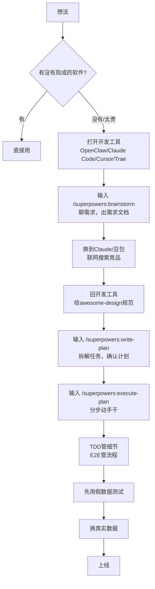

# 用AI帮你将想法落地成产品，我把踩坑经验总结成这套方法论，拿去直接用

---

我干了十几年开发，让AI帮我做东西，照样翻车——界面丑、逻辑乱、修修补补没完没了。

两个月前，我想做一个"待办清单"工具，带分类、提醒、进度统计。打开Cursor，输入"帮我做一个待办App"。Cursor刷刷刷弄了几百行代码，点一下——报错。改了半天，终于不报错，但界面按钮歪七扭八，颜色辣眼睛，添加任务后刷新就没了。

后来才明白：**不是AI不行，是我不会用。**

之前翻车的流程是这样的：

```
想法 → 打开Cursor直接让AI干 → 报错 → 改 → 界面丑 → 再改 → 放弃
```

直到把这套方法论跑通。现在我3天就能做出一个能上线的产品。

下面就是完整方法。照着做，你也行。

---

## 核心原则（先记住这一条）

**不管做什么，先让AI出方案，你确认了，再让它动手干。**

别一上来就让AI直接做。它容易跑偏，你先看方案，纠正方向，它再做——省时间、省token、不生气。这听起来简单，但90%的人都死在这一步。

---

## 第一步：先问有没有现成的

想到了一个需求，第一反应不是"自己动手做"，而是"有没有现成的软件？"

**怎么问：**
- 打开Claude（https://claude.ai）或豆包（https://doubao.com），直接问："有没有现成的软件能做XXX？免费的优先。"
- 让AI联网搜索，帮你找

**真实案例：** 之前我想做个"团队待办清单"，本来准备自己搞。结果一问，Trello、Microsoft To Do全是免费的，直接用上了。省了3天。

**结论：** 有现成的就直接用，没有或太贵再自己搞。别重复造轮子。

---

## 第二步：想清楚到底要什么

有现成的就用，没有，就打开开发工具（OpenClaw、Claude Code、Cursor、Trae都可以），在里面输入：

> `/superpowers:brainstorm`

这不是什么系统命令，就是你手动输入给AI的一段话。AI会像产品经理一样追问你：

- 这个产品给谁用？
- 要解决什么麻烦？
- 怎么算成功？

聊上10分钟，它会给你一份需求文档。

**真实案例：** 做待办清单时，AI问了我"要不要设截止时间""要不要进度条"——这些我之前都没想过。幸亏它问了，否则做出来根本没法用。

> 记住：AI出完需求文档，你看一遍，确认没问题了，再往下走。

---

## 第三步：让AI去搜别人怎么做的

换到Claude或豆包，开联网搜索，直接说：

> "我想做个待办清单，能分类、设提醒、看进度。你去网上搜有哪些现成的软件，再去GitHub搜相关仓库，选最近有更新、星星多的，列出它们的优缺点。"

AI会给你一份竞品分析报告。

**真实案例：** AI搜出一个GitHub开源项目，星星1.8k，代码结构清晰。我照着这个思路做，少干了一半的活。

> 记住：AI出完报告，你看一眼，确认没问题再继续。

---

## 第四步：设计界面——好看又好用

回到开发工具。这步解决两个问题：**好看**和**好用**。

**好看：用awesome-design定规范**

不是软件，是一段文字规则。打开 https://github.com/VoltAgent/awesome-design-md ，把里面的内容全部复制，发给AI，说："按照这套规范，帮我设计待办清单的界面。"

AI就不会瞎发挥——不会今天圆角明天方角，不会间距乱飘，出来的效果直接像专业设计师做的。

**好用：傻瓜式设计**

再加一句话：

> "核心操作不超过3步，菜单不超过5个，按钮用大白话。"

AI会自动把常用按钮放大，把不重要的藏起来。操作简单，小白零门槛。

---

## 第五步：拆解任务，分步执行

还是在开发工具里。先输入：

> `/superpowers:write-plan`

后面跟你的需求，比如："做一个待办清单，能添加任务、标记完成、删除。"

AI会输出一个计划，拆成若干个小步骤，每个步骤2-5分钟就能完成。你看一遍，确认没问题。

然后输入：

> `/superpowers:execute-plan`

AI就会一步步动手干。每做完一步，它会停下来问你："行不行？继续吗？"

**关键点：** 先做"添加任务"，测试没问题了，再做"标记完成"和"删除"。每一步确认，0返工。

---

## 第六步：测试验收

还是在开发工具里。两个词：**TDD**和**E2E**，两个都要。

**TDD（测试驱动开发）：** 先定规则，再动手做。比如先定一条规则："不填任务内容点添加，必须弹提示。"然后再让AI实现这条规则。TDD管的是每个零件的质量。

**E2E（端到端测试）：** 让AI假装真人，把完整流程跑一遍。比如："打开页面 → 输入任务 → 点添加 → 看到任务出现在列表 → 勾选完成 → 刷新页面 → 检查任务还在不在。"E2E管的是整体流程能不能跑通。

**怎么用：**
1. 动手做之前，让AI先定几条测试规则（TDD）
2. 做完后，让AI模拟真人跑一遍完整流程（E2E）
3. 发现问题就修，修完再测，直到全过

**一个数据技巧：** 先用3-5条假数据测试，逻辑没问题了再换真实数据。省token、省时间。

---

## 完整流程图

```
想法
  ↓
先问有没有现成的（问朋友、问Claude/豆包）
  ↓
有 → 直接用，结束
  ↓
没有或太贵
  ↓
打开开发工具（OpenClaw/Claude Code/Cursor/Trae）
输入 /superpowers:brainstorm 聊需求，出需求文档
  ↓
换到Claude/豆包，开联网搜索，让AI搜竞品
  ↓
回到开发工具，给awesome-design规范做设计
  ↓
输入 /superpowers:write-plan 拆解任务，确认计划
  ↓
输入 /superpowers:execute-plan 分步动手干
  ↓
测试：TDD管细节 + E2E管流程
  ↓
上线
```

用Mermaid画出来是这样的：



---

**核心就一句话：先让AI出方案，你确认了，它再动手。**

方法论不难，工具也都免费，关键是顺序别搞反。我踩过的坑总结成这一篇，你照着做就行，少走弯路。

现在就去试试。
