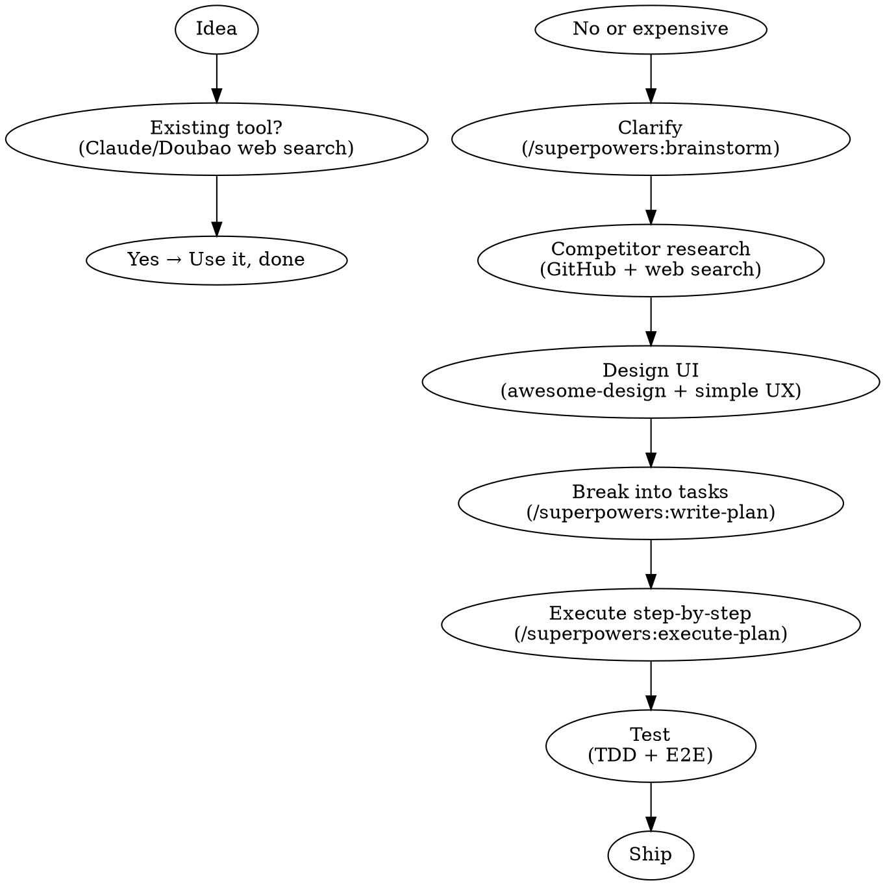

<SUBAGENT-STOP>
If you were dispatched as a subagent to execute a specific task, skip this skill.
</SUBAGENT-STOP>

<HARD-GATE>
Do NOT invoke any coding tool, write any code, scaffold any project, or take any implementation action until you have completed Steps 1–7 in order. This applies to EVERY project regardless of perceived simplicity.

**Violating the letter of this rule is violating the spirit of this rule.**
</HARD-GATE>

<EXTREMELY-IMPORTANT>
If the user wants to build something, you MUST use this skill BEFORE any code, scaffolding, or implementation action.
</EXTREMELY-IMPORTANT>

## Instruction Priority

1. **User's explicit instructions** (CLAUDE.md, direct requests) — highest priority
2. **This skill** — enforces the workflow sequence
3. **Default behavior** — lowest priority

## The Iron Rule

**AI produces a plan first — you confirm — AI executes.**

Never let AI start coding immediately. The order is the method.

---

## When to Use

**Activate when user says things like:**
- "I want to build an app that does X"
- "I tried with Cursor but got messy output"
- "Can you help me build this?"
- "I have an idea for a product"
- Skipping directly to "write code" or "build this"

**Do NOT activate for:**
- Debugging existing code
- Questions about existing projects
- This skill's own development

---

## The 7-Step Workflow

---

## Step-by-Step

### Step 1 — Check for existing solutions

Open Claude (claude.ai) or Doubao with web search. Ask:
> "Is there free existing software that can do [X]? Prioritize free."

**If yes → use it, done. No need to build.**

### Step 2 — Clarify requirements (HARD-GATE)

Use `/superpowers:brainstorm`. The AI追问:
- Who is this for?
- What problem does it solve?
- What counts as success?

**You must read and confirm the requirements doc before proceeding.**

### Step 3 — Research competitors

In Claude/Doubao with web search:
> "Search for [X] on GitHub. Prioritize recent updates, high stars. List pros and cons."

### Step 4 — Design the UI

**Good-looking:** Use awesome-design规范
- Open: https://github.com/VoltAgent/awesome-design-md
- Copy all content, paste to AI
- Say: "Design [app] following these guidelines"

**Easy to use:** Add constraint:
> "Core actions within 3 steps, ≤5 menu items, plain-language buttons"

### Step 5 — Break into tasks

Use `/superpowers:write-plan` with your requirements. AI拆成2-5分钟的小步骤. **Review and confirm the plan.**

### Step 6 — Execute step by step

Use `/superpowers:execute-plan`. AI分步执行，每步完成后暂停等你确认。**先做添加功能，测试完再做删除。每一步确认，零返工。**

### Step 7 — Test

**TDD (parts):** Write test rules before coding. e.g. "Clicking Add with empty input must show a prompt."

**E2E (whole flow):** AI模拟真人完整流程:
> "Open → type task → click Add → see in list → check Complete → refresh → verify data persists"

**Tip:** Test with 3-5 fake data entries first. Swap real data once logic is solid.

---

## Platform Setup

This skill works in any AI coding tool that supports skills or slash commands.

| Tool | How to use |
|------|-----------|
| **Claude Code** | Skills auto-discovered if placed in skills directory |
| **OpenClaw** | Tell it: "Follow the idea-to-product skill" |
| **Cursor** | Paste SKILL.md content, or use plugin manager |
| **Trae** | Paste SKILL.md as system instructions |
| **Any AI tool** | Copy SKILL.md content, paste into conversation as instructions |

---

## Common Mistakes

| Mistake | Fix |
|---------|-----|
| AI starts coding immediately | Always get plan first, confirm, then code |
| Skipping competitor research | Ask AI to search first — saves days |
| No design规范 | Use awesome-design every time |
| Too many features at once | Execute one step, test, next |
| Skipping TDD | Write 3-5 test rules before coding |
| Skipping E2E | Run full user journey before shipping |

---

## Red Flags — STOP and Start Over

These thoughts mean **delete everything and restart**:

| Excuse | Reality |
|--------|---------|
| "This is too simple to need a plan" | Simple projects are where unexamined assumptions cause the most wasted work |
| "I'll just start coding, it's faster" | Coding without a plan = coding without a destination |
| "I already know what to build" | Your idea in your head ≠ a shared spec the AI can execute |
| "I'll test later" | No tests = no way to know if it actually works |

**All of these mean: Start over from Step 1.**

## Rationalization Table

| Excuse | Reality |
|--------|---------|
| "Step 1 (existing tools) is optional" | Skipping Step 1 means building what already exists for free |
| "I'll skip TDD, it's a small project" | Every project is "small" until it breaks in production |
| "I'll do all features at once" | Batching features = no testing, no rollback, no idea what broke |
| "The UI is fine, I'll fix it later" | UI debt compounds. Fix it in Step 4, not Step 7 |

## Referenced Tools

| Tool | Use for |
|------|---------|
| `/superpowers:brainstorm` | Requirements clarification |
| `/superpowers:write-plan` | Task decomposition |
| `/superpowers:execute-plan` | Step-by-step execution |
| awesome-design | UI design规范 |
| Claude/Doubao web search | Competitor research |
