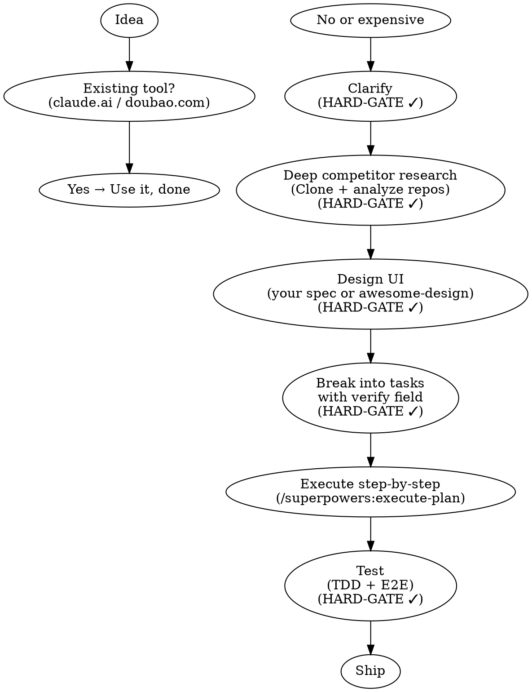

<SUBAGENT-STOP>
If you were dispatched as a subagent to execute a specific task, skip this skill.
</SUBAGENT-STOP>

<HARD-GATE>
**Two steps are absolute — no exceptions, no alternatives:**

- **Step 2 — Requirements (HARD-GATE):** Must be done. No way around it. AI must追问 and user must confirm.
- **Step 7 — Testing (HARD-GATE):** Must be done. TDD + E2E. Both must pass before shipping.

**Three steps are mandatory but allow user preference:**

- **Step 3 — Competitor research (HARD-GATE):** Must be done. But user can set their own criteria (e.g. "focus on mobile apps only", "prioritize open-source only").
- **Step 4 — UI design (HARD-GATE):** Must be done. But user can use their own design spec instead of awesome-design — just say "use [your spec]" and the AI will follow that.
- **Step 5 — Task plan (HARD-GATE):** Must be done. But user can choose the planning format.

**Step 1 and Step 6 have no gates.**

Skipping any HARD-GATE step = restart from Step 1.

**Violating the letter of this rule is violating the spirit of this rule.**
</HARD-GATE>

<EXTREMELY-IMPORTANT>
If the user wants to build something, you MUST use this skill BEFORE any code, scaffolding, or implementation action.
</EXTREMELY-IMPORTANT>

## Instruction Priority

1. **User's explicit instructions** (CLAUDE.md, direct requests) — highest priority
2. **This skill** — enforces the workflow sequence
3. **Default behavior** — lowest priority

## The Iron Rule

**AI produces a plan first — you confirm — AI executes.**

Never let AI start coding immediately. The order is the method.

---

## When to Use

**Activate when user says things like:**
- "I want to build an app that does X"
- "I tried with Cursor but got messy output"
- "Can you help me build this?"
- "I have an idea for a product"
- Skipping directly to "write code" or "build this"

**Do NOT activate for:**
- Debugging existing code
- Questions about existing projects
- This skill's own development

---

## The 7-Step Workflow



**Legend:** HARD-GATE ✓ = mandatory, must confirm before proceeding.

---

## Step-by-Step

### Step 1 — Check for existing solutions

Open Claude (claude.ai) or Doubao with web search. Ask:
> "Is there free existing software that can do [X]? Prioritize free."

**If yes → use it, done. No need to build.**

### Step 2 — Clarify requirements (HARD-GATE)

Use `/superpowers:brainstorm`. Ask one question at a time:
- Who is this for?
- What problem does it solve?
- What counts as success?

**Write the clarified requirements into `PROJECT.md`** in the project root. This file persists context and prevents quality decay over long sessions.

**You must read and confirm the requirements doc before proceeding.**

**[HARD-GATE: Do not proceed until user confirms the requirements doc.]**

### Step 3 — Deep competitor research (HARD-GATE)

This is NOT a quick web search. Must be done. Clone repos and study deeply.

**Competitor selection criteria — prioritize repos with ALL of:**
- GitHub stars: ≥ 1k (higher = more validated by community)
- Recent activity: updated in the last 6 months
- Positive reception: issues being closed, active discussion, good readme

**Research protocol:**
1. Search GitHub for similar products, rank by stars + recency + activity
2. Select top 2-3 repos matching the criteria above
3. Clone each repo: `git clone <repo-url>`
4. Read the full README — understand why it was built this way
5. Read the source code structure: `find . -name "*.py" -o -name "*.ts" -o -name "*.js" | head -20`
6. Run it: `npm install && npm run dev` or equivalent
7. Identify what it does well → **learn from it**
8. Identify what it does poorly → **avoid repeating those mistakes**
9. Write a comparison table:

| Competitor | Stars | Last updated | What it does well | What it does poorly | What we'll borrow | What we'll avoid |
|------------|-------|-------------|-------------------|---------------------|-------------------|-----------------|

**Only after this deep research should you move to Step 4.**

**[HARD-GATE: Show the competitor learnings table. Do not proceed until user approves it.]**

### Step 4 — Design the UI (HARD-GATE)

Must be done. User can bring their own design spec.

**If user has a design spec:** Say "use [your spec]" — AI will follow it exactly.

**If no spec provided:** Use awesome-design as default:
- Clone or open: https://github.com/VoltAgent/awesome-design-md
- Copy the relevant DESIGN.md content, paste to AI
- Say: "Design [app] following these guidelines"

**Regardless of spec source, always add:**
> "Core actions within 3 steps, ≤5 menu items, plain-language buttons"

**Do's and Don'ts — apply these to every design:**

| Do ✅ | Don't ❌ |
|-------|---------|
| Use consistent spacing (8px grid) | Mix pixel values arbitrarily |
| Name buttons by action: "Save", "Delete" | Abstract names: "Submit", "Process" |
| Show loading states | Leave users guessing if it's working |
| Empty states with guidance | Blank screens that say nothing |
| Error messages explain the fix | Generic "Something went wrong" |

**[HARD-GATE: Show the UI design. Do not proceed until user approves the design direction.]**

### Step 5 — Break into tasks

Use `/superpowers:write-plan` with your requirements. Each task MUST include:

```yaml
- name: "Task description"
  action: "What to do"
  verify: "Command or check to confirm it works"
  done: "What 'done' looks like"
```

**Every task needs a `verify:` field.** If you can't verify it, you can't ship it.

Example:
```yaml
- name: "Add task input field"
  action: "Create input with placeholder 'What needs to be done?'"
  verify: "Open app → input field visible → placeholder text correct"
  done: "User can type in the field"
```

**Review and confirm the plan with user before Step 6.**

**[HARD-GATE: Show the full task breakdown with verify fields. Do not proceed until user approves the plan.]**

### Step 6 — Execute step by step

Use `/superpowers:execute-plan`. For each task:
1. AI does the task
2. Run the `verify:` check
3. Show the result to user
4. User confirms → next task

**Rule:** Always add before delete. Always verify before moving on.

### Step 7 — Test

**TDD (parts):** Write test rules before coding. Example rules:
- "Clicking Add with empty input must show a prompt"
- "Completed tasks must show strikethrough styling"
- "Deleting a task must remove it from the list immediately"

**E2E (whole flow):** Run the full user journey:
> "Open → type task → click Add → see in list → check Complete → refresh → verify data persists"

**Tip:** Test with 3-5 fake data entries first. Swap real data once logic is solid.

**[HARD-GATE: All TDD tests must pass. E2E flow must run end-to-end without error. Do not ship until both pass.]**

---

## Context File: PROJECT.md

Create `PROJECT.md` at project root after Step 2. Keep it updated through Step 7.

**Template:**
```markdown
# [Project Name]

## Problem solved
[1-2 sentences]

## Target user
[Who uses this]

## Success criteria
[How do we know it's done]

## Competitor learnings
[From Step 3 — borrow X, avoid Y]

## Design direction
[From Step 4 — key UI decisions, or user's own design spec]

## Design spec
[awesome-design default, or user's preferred spec — e.g. "use Material Design"]

## Status
- [ ] Step 1: Existing tools checked
- [ ] Step 2: Requirements confirmed
- [ ] Step 3: Competitors researched
- [ ] Step 4: UI designed
- [ ] Step 5: Plan approved
- [ ] Step 6: Implementation in progress
- [ ] Step 7: Testing
```

---

## Platform Setup

This skill works in any AI coding tool that supports skills or slash commands.

| Tool | How to use |
|------|-----------|
| **Claude Code** | Skills auto-discovered if placed in skills directory |
| **OpenClaw** | Tell it: "Follow the idea-to-product skill" |
| **Cursor** | Paste SKILL.md content, or use plugin manager |
| **Trae** | Paste SKILL.md as system instructions |
| **Any AI tool** | Copy SKILL.md content, paste into conversation as instructions |

---

## Common Mistakes

| Mistake | Fix |
|---------|-----|
| AI starts coding immediately | Always get plan first, confirm, then code |
| Quick search ≠ competitor research | Clone repos, run them, study their code |
| No design规范 | Use awesome-design every time |
| Too many features at once | Execute one step, test, next |
| Skipping TDD | Write 3-5 test rules before coding |
| Skipping E2E | Run full user journey before shipping |
| No context file | Always write PROJECT.md after Step 2 |

---

## Red Flags — STOP and Start Over

These thoughts mean **delete everything and restart**:

| Excuse | Reality |
|--------|---------|
| "This is too simple to need a plan" | Simple projects are where unexamined assumptions cause the most wasted work |
| "I'll just start coding, it's faster" | Coding without a plan = coding without a destination |
| "I already know what to build" | Your idea in your head ≠ a shared spec the AI can execute |
| "I'll test later" | No tests = no way to know if it actually works |
| "A quick web search is enough for competitors" | Surface-level search misses what you learn only by running their code |

**All of these mean: Start over from Step 1.**

## Rationalization Table

| Excuse | Reality |
|--------|---------|
| "Step 1 (existing tools) is optional" | Skipping Step 1 means building what already exists for free |
| "I'll skip TDD, it's a small project" | Every project is "small" until it breaks in production |
| "I'll do all features at once" | Batching features = no testing, no rollback, no idea what broke |
| "The UI is fine, I'll fix it later" | UI debt compounds. Fix it in Step 4, not Step 7 |

